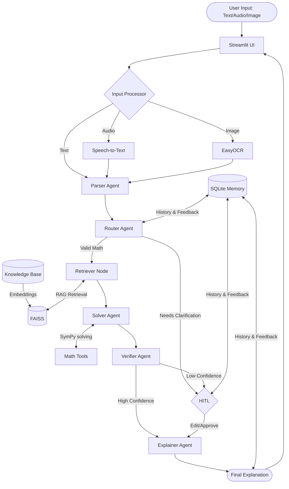

# Multimodal Math Mentor

An AI-powered system designed to solve JEE-level math problems using localized Retrieval-Augmented Generation (RAG), a multi-agent orchestration pipeline, Human-in-the-Loop (HITL) validation, and persistent memory.

## Features

- **Multimodal Input**: Supports mathematical problems via Text, Image (OCR), and Audio (Speech-to-Text).
- **Retrieval-Augmented Generation (RAG)**: Fetches relevant mathematical context from a local knowledge base using FAISS.
- **Multi-Agent Reasoning**: Orchestrates Specialized Agents (Parser, Router, Solver, Verifier, Explainer) for robust problem solving.
- **Symbolic Math Solving**: Performs accurate calculations using SymPy, ensuring mathematical correctness for equations, calculus, and matrices.
- **Human-in-the-Loop (HITL)**: Triggers manual validation for low-confidence results or ambiguous inputs.
- **Persistent Memory**: Stores interaction history and feedback, enabling retrieval of similar previously solved problems.
- **Fully Offline Execution**: Runs entirely on local hardware using open-source models (TinyLlama, Whisper, EasyOCR, BGE-Embeddings). **No API keys are required.**

## Architecture



## Setup

The system runs fully offline using open-source models. No API keys are required.

1.  **Create a virtual environment and activate it**:
    ```powershell
    python -m venv venv
    .\venv\Scripts\activate
    ```

2.  **Install dependencies**:
    ```powershell
    pip install -r requirements.txt
    ```

3.  **Run the application**:
    ```powershell
    streamlit run app.py
    ```

## Demo

Here are some example problems the system is optimized to solve:

- **Algebra**: `Solve for x: 3x + 7 = 16`
- **Calculus**: `Derivative of x**2 + 3x`
- **Limits**: `limit x->0 sin(x)/x`
- **Probability**: `Probability of getting a number greater than 4 when a die is thrown`
- **Matrices**: `Determinant of [[1, 2], [3, 4]]`

---
*Note: On first run, the system will download the local models (TinyLlama, Whisper, EasyOCR) to your machine. All subsequent runs will be entirely offline.*
